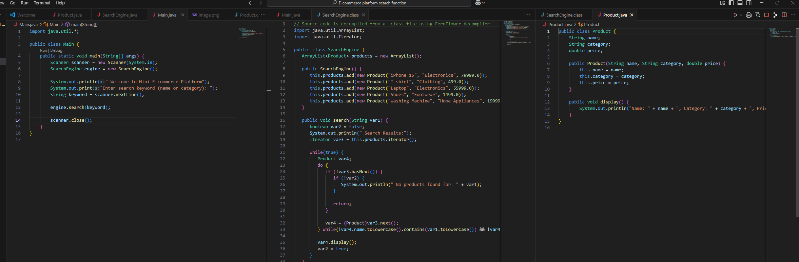
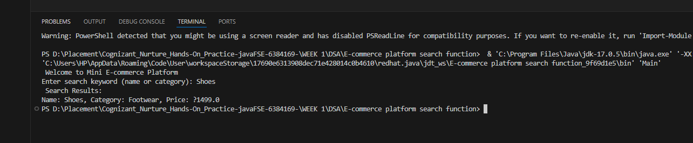

📄 README.md
markdown
Copy
Edit
# 🛍️ E-commerce Platform Search Function (Java Console App)

This is a simple Java console application that simulates a product search function for an e-commerce platform. Users can search for products by name or category, and the program returns matching results from a predefined list.

---

## 🧠 Concept

The project demonstrates:
- Basic object-oriented programming in Java
- Use of classes and objects (`Product`, `SearchEngine`)
- Simple search functionality with string matching
- Console-based user input and output

---

## 🚀 Features

- ✅ Search products by name or category
- 🗃️ Predefined product list in memory
- 🔍 Case-insensitive keyword matching
- 📄 Simple and readable code structure
- 🖥️ Fully command-line based (no external libraries)

---

## 📦 Folder Structure

EcommerceSearch/
├── Product.java # Product data model
├── SearchEngine.java # Handles product searching
└── Main.java # Main program (user input/output)

yaml
Copy
Edit

---

## 📷 Sample Output




---

## 🛠️ How to Run

1. Clone or download this repository.
2. Navigate to the project folder in terminal.
3. Compile and run:

```bash
javac *.java
java Main
💡 If you face encoding issues (e.g. emoji errors), use plain text or compile using UTF-8:
