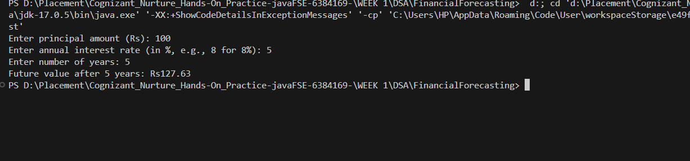

# 📈 Financial Forecasting in Java using Recursion

This project demonstrates a simple financial forecasting tool using **Java** and **recursion**. It calculates the **future value** of an investment based on user input such as principal amount, interest rate, and number of years.

---

## 🧠 Concept

The program uses the **compound interest formula** with recursion:

FV = P × (1 + r)^n

yaml
Copy
Edit

Where:
- `FV` = Future Value
- `P` = Principal Amount
- `r` = Interest Rate (in decimal)
- `n` = Number of Years

---

## 🚀 Features

- ✅ Takes user input for principal, interest rate, and duration
- 🔁 Uses recursive method for future value calculation
- 💡 Simple, single-file Java implementation
- 📦 No external libraries required

---

## 📷 Screenshot




---

## 🛠️ How to Run

1. **Save the code in a file** called `FinancialForecast.java`
2. **Compile the program:**
   ```bash
   javac FinancialForecast.java

