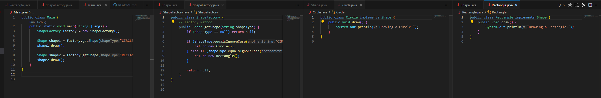
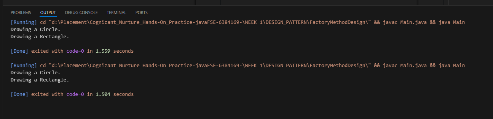

# 🏭 Factory Method Design Pattern in Java

This project demonstrates the implementation of the **Factory Method Design Pattern** in Java using a simple `ShapeFactory` example.

The Factory Method pattern allows for creating objects without specifying their exact class. It promotes loose coupling and makes the code easier to scale and maintain.

---

## 🚀 Features

- Clean object-oriented design using interfaces and factories
- Supports multiple product types (`Circle`, `Rectangle`, etc.)
- Demonstrates separation of object creation from usage
- Easily extensible – just add more shapes!

---

## 🛠️ Technologies Used

- Java (JDK 8 or above)
- OOP Concepts: Interfaces, Inheritance, Encapsulation
- Factory Method Design Pattern

---

## 📂 Project Structure

FactoryPattern/
├── Shape.java # Interface
├── Circle.java # Concrete class
├── Rectangle.java # Concrete class
├── ShapeFactory.java # Factory class
├── Main.java # Test class
├── README.md # Documentation
└── images/
└── factory-output.png

yaml
Copy
Edit

---

## 🔧 How It Works

1. The `Shape` interface defines a common contract.
2. `Circle` and `Rectangle` are concrete implementations of `Shape`.
3. `ShapeFactory` uses a method `getShape(String type)` to decide which object to create.
4. The client code (`Main.java`) requests shapes through the factory without directly instantiating them.

---

## 🧪 Sample Code

  

