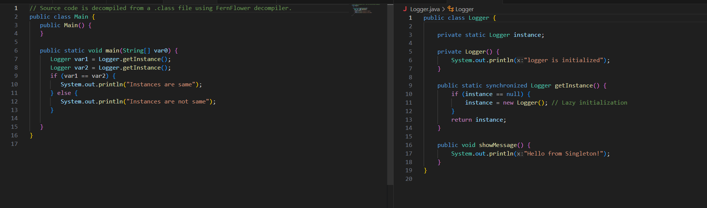
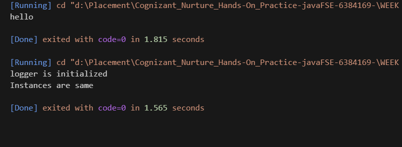

# Logger Singleton in Java

This project demonstrates the implementation of the **Singleton Design Pattern** in Java using a `Logger` class with **lazy initialization** and **block-level synchronization** (double-checked locking).

## 🚀 Features

- Ensures a single instance of `Logger` across the application
- Thread-safe using block-level synchronization
- Lightweight and easy to use
- Console logging support

## 🛠️ Technologies Used

- Java (JDK 8 or higher)
- Object-Oriented Programming Principles
- Singleton Design Pattern

## 📂 Project Structure

LoggerSingleton/
├── Logger.java # Singleton Logger class
├── Main.java # Test class to use Logger
└── README.md # Project documentation

pgsql
Copy
Edit

## 🔧 How It Works

1. The constructor of the `Logger` class is marked `private` to restrict external instantiation.
2. `getInstance()` checks if an instance already exists.
3. If not, it enters a `synchronized` block and creates a new instance (only once).
4. All future calls to `getInstance()` return the same object.

## 📸 Snapshot

Here’s a sample console output of the Logger Singleton:

  

